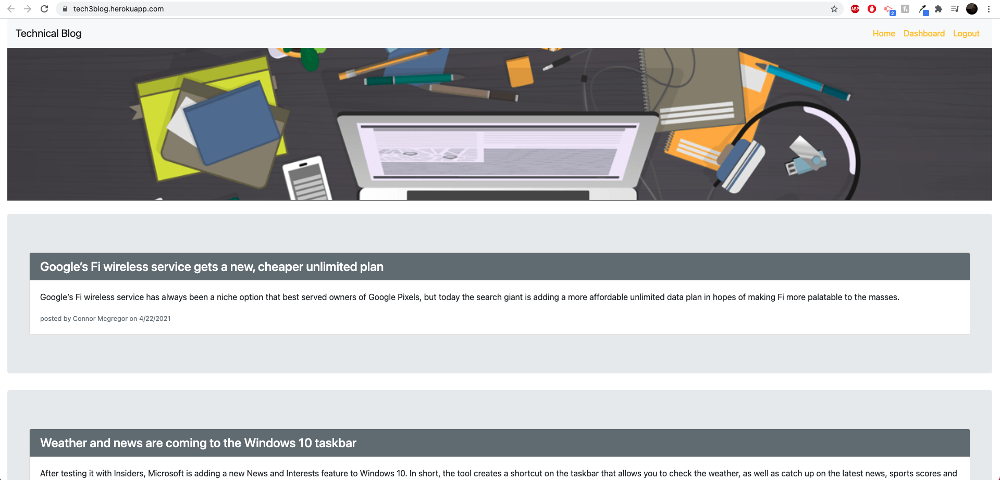

# Tech_Blog

* [About-project](#Description)
* [Usage](#Usage)
* [License](#License)
* [Contributor](#Contributor)
* [Email-adress](#Email)
* [LinkedIn-profile](#LinkedIn-profile)
* [GitHub-profile](#GitHub-profile)

   
### About the project:
  This is a full stack blogging application where a user can log in, post, update, delete posts. Also the user can comment on other users's posts. The app uses an Express server, Sequelize database model, and Sequelize session store to persist a login state. The server and database are deployed to Heroku. 
Screenshots: 

### Usage:
Open deployment application [https://tech3blog.herokuapp.com/]

### License:
MIT

### Contributor:
Sandu Corobcenco

### Email adress:
corobcenco.sandu@gmail.com

### LinkedIn profile:
https://www.linkedin.com/in/sandu-corobcenco-527131165/

### GitHub profile:
https://github.com/SanduCorobcenco
